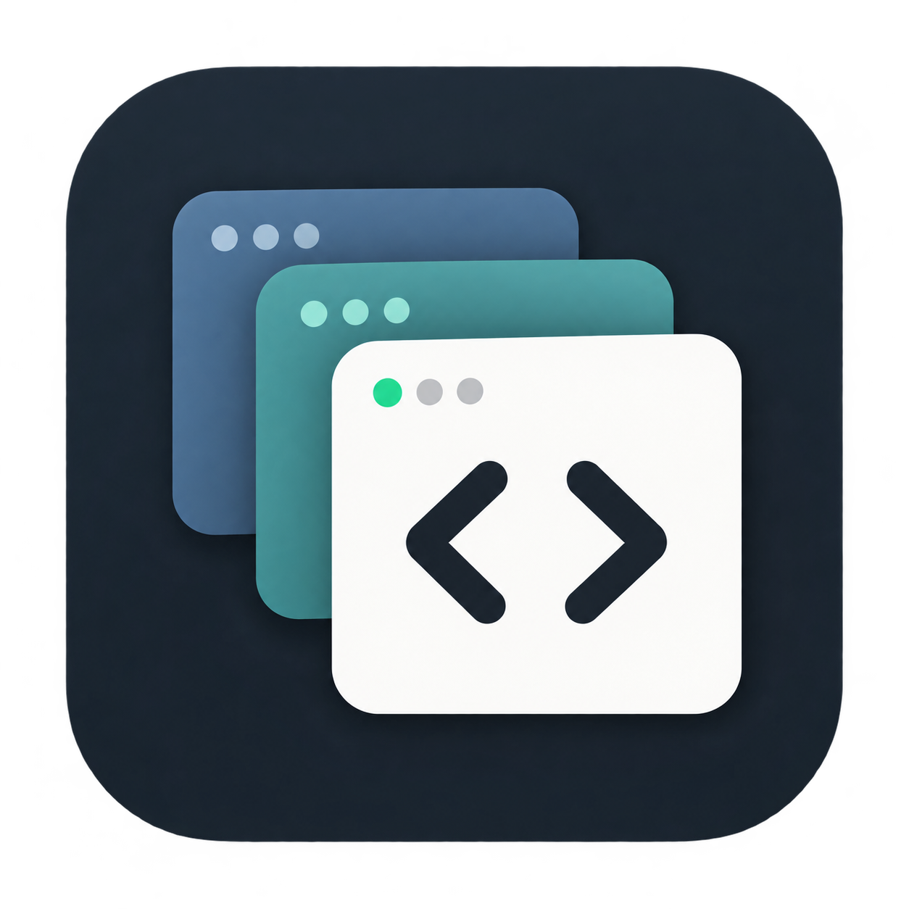
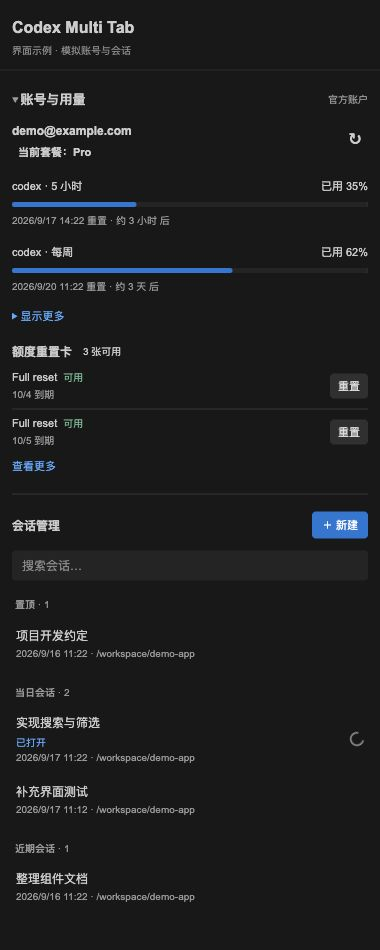
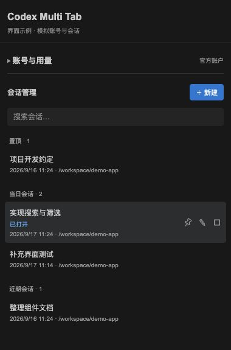
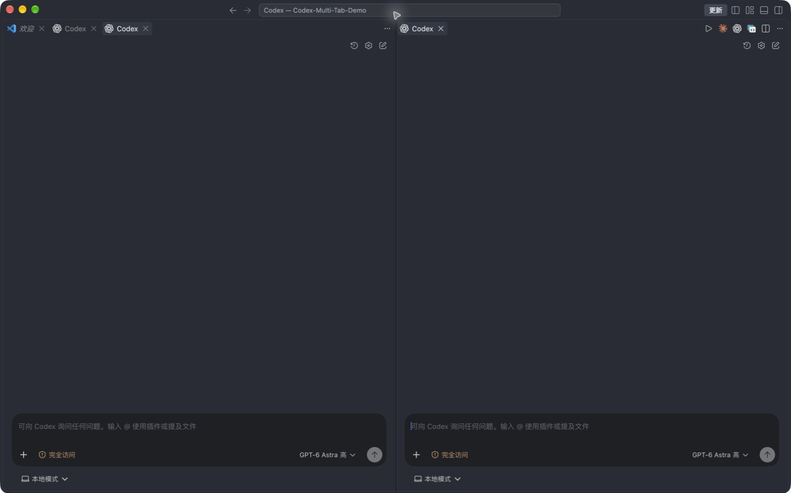

# Codex Multi Tab

简体中文 | [English](README.en.md)



在 VS Code 中打开多个独立 Codex 标签，按当前项目管理会话，并在侧栏查看官方账号与用量。

这是与 OpenAI 无隶属关系的社区辅助扩展，需要安装官方 **Codex（`openai.chatgpt`）**。聊天、登录、模型和工具能力均由官方扩展提供。

**English overview:** Independent Codex editor tabs, project-scoped conversation management, and official account usage in one sidebar. This unofficial extension requires OpenAI's Codex extension. Native enhancements modify audited extension assets with backups and compatibility checks; future versions may require adaptation. Only the macOS ARM64 builds listed below have been verified.

## 功能一览

- **独立多 Tab 与分屏**：每次新建独立编辑器标签，可拖入不同编辑器组；标签标题随当前会话及重命名结果更新。
- **按项目管理会话**：列表、搜索和置顶只显示当前工作区根目录及子目录内的会话，支持多文件夹工作区；按置顶、当日会话、近期会话分组。
- **快速继续历史会话**：在侧栏点击会话，已打开则定位原标签，否则新建标签。悬停、键盘聚焦或右键即可置顶、取消置顶、重命名。
- **官方运行状态**：运行中的会话显示转圈标志，每 2 秒同步状态；可停止点击时的当前轮次，无法确认状态或轮次时不提供停止操作。
- **账号与官方用量**：显示官方提供的套餐、额度窗口和重置时间，支持手动刷新；侧栏启用后每分钟检测登录状态，已登录时自动刷新账号、用量和重置卡，保留会话搜索与焦点。
- **多账号切换**：保存当前账号、通过官方浏览器登录添加账号，支持备注与移除；点击已保存账号即可切换并重载当前窗口。凭据使用 VS Code 加密存储，首版支持本地文件式 ChatGPT 登录缓存。
- **官方额度重置卡**：查看可用总数、卡片名称和失效时间；确认后实际使用选中的卡片。结果不确定时不会自动重复消费。
- **原生历史增强**：在官方历史面板中置顶、改名，并在当前聊天标签继续历史任务；切换前提醒保存未发送内容。

> **停止的范围**：侧栏的 Stop 仅停止当前轮次，不暂停自主目标（goal），也不执行原生整会话的后台终端清理。需要暂停自主目标时，请使用官方会话内的停止入口。

## 界面预览



侧栏概览示例：使用实际侧栏界面及模拟账号、用量和会话数据，展示布局与功能，不代表真实账号权益。



会话操作示例：使用实际侧栏界面及模拟会话状态，展示悬停后的置顶、重命名与 Stop 按钮；右键菜单也提供相同操作。未操作真实运行任务。



实机截图：三个独立空白标签，其中两个在左右编辑器组同时显示；未包含真实会话内容。

## 安装与使用

需要 **VS Code 1.96.2 或更新版本**及官方 Codex 扩展。当前已验证的平台与版本见下文兼容说明。

1. 从扩展市场安装 **Codex Multi Tab**（发布者 `mofyer`），并在官方 Codex 中完成登录。也可从 [GitHub Releases](https://github.com/mofyer/codex-multi-tab/releases) 下载 VSIX，通过 **Extensions: Install from VSIX...** 安装。
2. 首次应用增强后，保存草稿、等待运行中的任务结束，再按提示重载窗口；扩展不会自动重载或停止任务。
3. 打开项目文件夹，点击活动栏中的 **Codex Multi Tab** 图标，查看账号、用量和本项目会话。
4. 点击编辑器或官方 Codex 侧栏右上角的新建图标，或使用下列命令打开独立标签。

| 操作 | 命令或快捷键 |
| --- | --- |
| 新建独立标签 | **Codex：新建独立标签页** |
| 在右侧分屏新建 | **Codex：在右侧新建独立标签页** |
| macOS 快捷键 | **⌘⌥⇧N** |
| Windows / Linux 快捷键 | **Ctrl+Alt+Shift+N**（平台兼容范围见下文） |

侧栏里的历史会话会定位或新建标签；聊天页面内的**原生历史按钮**则在当前标签切换会话。原生切换提醒不会自动保存草稿，取消可保留当前内容。

用量中的 GPT-5.3 额度默认收起，可点击「显示更多」展开。重置卡默认展示两张，可点击「查看更多」；悬停失效日期可查看完整时间。额度重置时间不是套餐失效日期，官方未提供的数据会显示为不可用，不用零值代替。

多账号使用顺序：**保存当前账号 → 添加账号并完成浏览器登录 → 在已保存列表点击切换**。切换影响所有共享登录缓存的 Codex 客户端，并重载当前窗口；请先结束任务、保存草稿。钥匙串、远程、WSL 和 API Key 模式暂不支持，过期凭据需重新登录。详情见[多账号设计与验收](docs/multi-account.md)。

从 0.5.3 起，接口结果决定操作完成状态，通知仅用于告知；通知保持打开或显示失败，均不阻塞按钮恢复和额度刷新。若旧版本已卡在“处理中”，安装更新后请先结束任务、保存草稿，再重载窗口；先刷新核对卡状态，不要重复消费。

## 官方更新与兼容

原生界面与侧栏数据能力依赖官方扩展的内部接口及少量资产补丁。扩展会校验已审计文件、保留原始备份，并在启动或官方扩展变化时检查兼容性；**不保证所有后续 Codex 更新自动兼容**。

- 当前 **0.5.3** 回归覆盖官方 **26.908.40401（macOS ARM64）** 安装资产副本的补丁应用、幂等、修改保护及恢复；本轮 201 项测试中 197 项通过，4 项因缺少旧版或缓存资产而跳过。Windows、Linux、macOS Intel 尚未验证，不承诺原生增强可用。
- 版本号变化但已审计资产字节完全相同时，可复用兼容配置；哈希或内部结构变化时拒绝修改并提示需要适配。
- 基础新建标签也依赖官方内部 URI，其变化可能需要适配。桥接不可用时侧栏显示兼容提示，仍保留新建标签入口。
- 升级辅助扩展不会覆盖存放在其 VS Code `globalStorage/patch-backups/` 下的原始备份。**禁用或卸载不会自动恢复已修改的官方文件**，恢复方法见下文。

## 使用边界

- 项目隔离目前支持本地文件夹；无项目时不显示会话，远程或虚拟工作区会提示暂不支持，不退回全账号列表。
- 当日会话按本机日期和最后更新时间判断。较多历史记录需要分批扫描，未扫描完时可继续加载。
- 置顶、改名使用官方接口与状态，跨应用同步仍受官方机制约束。本扩展不会绕过会话占用保护，也不改变登录、鉴权、模型或工具权限。
- 尚未实现重启后将每个辅助标签恢复到对应会话；标签可能恢复为空白聊天，已发送会话可从历史重新打开。未发送草稿请自行保存。

## 支持与反馈

请在 [GitHub Issues](https://github.com/mofyer/codex-multi-tab/issues) 提交问题，并按[支持说明](SUPPORT.md)附上版本、系统及复现步骤。勿上传令牌、真实会话内容或补丁备份。

版本变化见 [CHANGELOG.md](CHANGELOG.md)。

## 技术与恢复说明

侧栏共用官方扩展当前连接，不另起登录或模型进程。官方搜索接口不支持递归目录筛选，因此扩展进程先读取分页元数据、按工作区过滤，再发送到侧栏；项目隔离是展示与操作范围，不表示服务端只返回本项目元数据。每批最多扫描十页。

运行态来自官方通知及只读元数据。停止采用准备与提交两阶段，复查项目、当前轮次后提交一次性票据；复查期间切项目或换轮次会取消发送。原生增强仍为实验功能，自动化检查不能代替实际平台验证。

### 恢复原始文件

先禁用 Codex Multi Tab，防止再次自动应用。保留源码或已安装扩展目录中的脚本，执行：

```sh
node title-patch.js restore "<官方扩展实际安装目录>" "<Codex Multi Tab globalStorage 下的 patch-backups 目录>"
```

旧版手动补丁使用源码目录下的 `backups/`，无需第三个参数：

```sh
npm run title:restore -- "<官方扩展实际安装目录>"
```

恢复会校验备份与当前文件，拒绝覆盖其他工具或官方更新产生的未知改动。完成后重载窗口。备份不随 Git 仓库或 VSIX 分发。

### 旧本地版迁移

市场版 ID 为 `mofyer.codex-multi-tab`，旧本地版为 `yafan-local.codex-multi-tab`，两者不能同时启用。

旧版用户先禁用旧扩展，保存草稿、等待任务结束并退出所有 VS Code 窗口。将旧扩展 `globalStorage` 下完整的 `patch-backups/` 复制到新扩展对应目录，保留旧备份，再安装并启用市场版。目标已有备份时不要覆盖；目前不支持跨发布者 ID 自动迁移。首次安装无需此步骤。

macOS 默认存储根目录为 `~/Library/Application Support/Code/User/globalStorage/`，新旧扩展子目录名分别为上述完整 ID。

### 开发与打包

```sh
npm run check
npm test
npm run package
code --install-extension dist/codex-multi-tab-0.5.3-mofyer.vsix --force --do-not-sync
```

测试覆盖标签隔离、会话管理、运行态与停止、兼容检测、哈希校验、失败回滚和逐字节恢复。缺少对应官方安装包时，相关实包测试会明确标记跳过。

源码位于 `src/`，侧栏页面资源位于 `media/sidebar/`，图标和市场截图位于 `assets/`。打包产物统一输出到 `dist/`；旧恢复命令及根目录 `backups/` 路径保持兼容。目录职责、开发流程与打包边界见 [开发指南](https://github.com/mofyer/codex-multi-tab/blob/main/docs/development.md)。打包使用 Node.js 22 或更高版本，首次运行会下载固定版本的 VSCE；`npm run package` 会先执行语法检查和测试。
